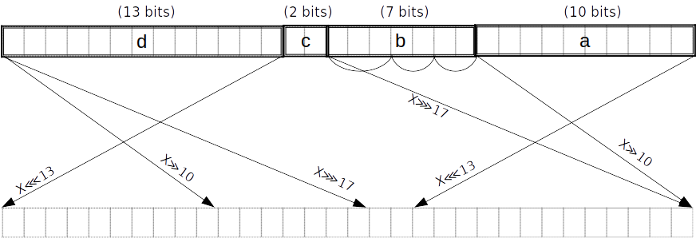

# 16-bit table chip for SHA-256

This chip implementation is based around a single 16-bit lookup table. It requires a
minimum of $2^{16}$ circuit rows, and is therefore suitable for use in larger circuits.

We target a maximum constraint degree of $9$. That will allow us to handle constraining
carries and "small pieces" to a range of up to $\{0..7\}$ in one row.

## Compression round

There are $64$ compression rounds. Each round takes 32-bit values $A, B, C, D, E, F, G, H$
as input, and performs the following operations:

$$
\begin{array}{rcl}
Ch(E, F, G)  &=& (E \wedge F) \oplus (¬E \wedge G) \\
Maj(A, B, C) &=& (A \wedge B) \oplus (A \wedge C) \oplus (B \wedge C) \\
             &=& count(A, B, C) \geq 2 \\
\Sigma_0(A)  &=& (A ⋙ 2) \oplus (A ⋙ 13) \oplus (A ⋙ 22) \\
\Sigma_1(E)  &=& (E ⋙ 6) \oplus (E ⋙ 11) \oplus (E ⋙ 25) \\
H' &=& H + Ch(E, F, G) + \Sigma_1(E) + K_t + W_t \\
E_{new} &=& reduce_6(H' + D) \\
A_{new} &=& reduce_7(H' + Maj(A, B, C) + \Sigma_0(A))
\end{array}
$$

where $reduce_i$ must handle a carry in $\{0, \ldots, i-1\}$.


Define $\mathtt{spread}$ as a table mapping a $16$-bit input to an output interleaved with
zero bits. We do not require a separate table for range checks because $\mathtt{spread}$
can be used.

### Modular addition

To implement addition modulo $2^{32}$, we note that this is equivalent to adding the
operands using field addition, and then masking away all but the lowest 32 bits of the
result. For example, if we have two operands $a$ and $b$:

$$a \boxplus b = c,$$

we decompose each operand (along with the result) into 16-bit chunks:

$$(a_L : \mathbb{Z}_{2^{16}}, a_H : \mathbb{Z}_{2^{16}}) \boxplus (b_L : \mathbb{Z}_{2^{16}}, b_H : \mathbb{Z}_{2^{16}}) = (c_L : \mathbb{Z}_{2^{16}}, c_H : \mathbb{Z}_{2^{16}}),$$

and then reformulate the constraint using field addition:

$$\mathsf{carry} \cdot 2^{32} + c_H \cdot 2^{16} + c_L = (a_H + b_H) \cdot 2^{16} + a_L + b_L.$$

More generally, any bit-decomposition of the output can be used, not just a decomposition
into 16-bit chunks. Note that this correctly handles the carry from $a_L + b_L$.

This constraint requires that each chunk is correctly range-checked (or else an assignment
could overflow the field).

- The operand and result chunks can be constrained using $\mathtt{spread}$, by looking up
  each chunk in the "dense" column within a subset of the table. This way we additionally
  get the "spread" form of the output for free; in particular this is true for the output
  of the bottom-right $\boxplus$ which becomes $A_{new}$, and the output of the leftmost
  $\boxplus$ which becomes $E_{new}$. We will use this below to optimize $Maj$ and $Ch$.

- $\mathsf{carry}$ must be constrained to the precise range of allowed carry values for
  the number of operands. We do this with a
  [small range constraint](../../../user/tips-and-tricks.md#small-range-constraints).

### Maj function

$Maj$ can be done in $4$ lookups: $2\; \mathtt{spread} * 2$ chunks

- As mentioned above, after the first round we already have $A$ in spread form $A'$.
  Similarly, $B$ and $C$ are equal to the $A$ and $B$ respectively of the previous round,
  and therefore in the steady state we already have them in spread form $B'$ and $C'$. In
  fact we can also assume we have them in spread form in the first round, either from the
  fixed IV or from the use of $\mathtt{spread}$ to reduce the output of the feedforward in
  the previous block.
- Add the spread forms in the field: $M' = A' + B' + C'$;
  - We can add them as $32$-bit words or in pieces; it's equivalent
- Witness the compressed even bits $M^{even}_i$ and the compressed odd bits $M^{odd}_i$ for $i = \{0..1\}$;
- Constrain $M' = \mathtt{spread}(M^{even}_0) + 2 \cdot \mathtt{spread}(M^{odd}_0) + 2^{32} \cdot \mathtt{spread}(M^{even}_1) + 2^{33} \cdot \mathtt{spread}(M^{odd}_1)$, where $M^{odd}_i$ is the $Maj$ function output.

> Note: by "even" bits we mean the bits of weight an even-power of $2$, i.e. of weight
> $2^0, 2^2, \ldots$. Similarly by "odd" bits we mean the bits of weight an odd-power of
> $2$.

### Ch function
> TODO: can probably be optimised to $4$ or $5$ lookups using an additional table.
>
$Ch$ can be done in $8$ lookups: $4\; \mathtt{spread} * 2$ chunks

- As mentioned above, after the first round we already have $E$ in spread form $E'$.
  Similarly, $F$ and $G$ are equal to the $E$ and $F$ respectively of the previous round,
  and therefore in the steady state we already have them in spread form $F'$ and $G'$. In
  fact we can also assume we have them in spread form in the first round, either from the
  fixed IV or from the use of $\mathtt{spread}$ to reduce the output of the feedforward in
  the previous block.
- Calculate $P' = E' + F'$ and $Q' = (evens - E') + G'$, where $evens = \mathtt{spread}(2^{32} - 1)$.
  - We can add them as $32$-bit words or in pieces; it's equivalent.
  - $evens - E'$ works to compute the spread of $¬E$ even though negation and
    $\mathtt{spread}$ do not commute in general. It works because each spread bit in $E'$
    is subtracted from $1$, so there are no borrows.
- Witness $P^{even}_i, P^{odd}_i, Q^{even}_i, Q^{odd}_i$ such that
  $P' = \mathtt{spread}(P^{even}_0) + 2 \cdot \mathtt{spread}(P^{odd}_0) + 2^{32} \cdot \mathtt{spread}(P^{even}_1) + 2^{33} \cdot \mathtt{spread}(P^{odd}_1)$, and similarly for $Q'$.
- $\{P^{odd}_i + Q^{odd}_i\}_{i=0..1}$ is the $Ch$ function output.

### Σ_0 function

$\Sigma_0(A)$ can be done in $6$ lookups.

To achieve this we first split $A$ into pieces $(a, b, c, d)$, of lengths $(2, 11, 9, 10)$
bits respectively counting from the little end. At the same time we obtain the spread
forms of these pieces. This can all be done in two PLONK rows, because the $10$ and
$11$-bit pieces can be handled using $\mathtt{spread}$ lookups, and the $9$-bit piece can
be split into $3 * 3$-bit subpieces. The latter and the remaining $2$-bit piece can be
range-checked by polynomial constraints in parallel with the two lookups, two small pieces
in each row. The spread forms of these small pieces are found by interpolation.

Note that the splitting into pieces can be combined with the reduction of $A_{new}$, i.e.
no extra lookups are needed for the latter. In the last round we reduce $A_{new}$ after
adding the feedforward (requiring a carry of $\{0, \ldots, 7\}$ which is fine).

$(A ⋙ 2) \oplus (A ⋙ 13) \oplus (A ⋙ 22)$ is equivalent to
$(A ⋙ 2) \oplus (A ⋙ 13) \oplus (A ⋘ 10)$:


Then, using $4$ more $\mathtt{spread}$ lookups we obtain the result as the even bits of a
linear combination of the pieces:

$$
\begin{array}{rcccccccl}
     &    (a    &||&    d    &||&    c   &||&   b) & \oplus \\
     &    (b    &||&    a    &||&    d   &||&   c) & \oplus \\
     &    (c    &||&    b    &||&    a   &||&   d) & \\
&&&&\Downarrow \\
R' = & 4^{30} a &+& 4^{20} d &+& 4^{11} c &+&   b\;&+ \\
     & 4^{21} b &+& 4^{19} a &+& 4^{ 9} d &+&   c\;&+ \\
     & 4^{23} c &+& 4^{12} b &+& 4^{10} a &+&   d\;&
\end{array}
$$

That is, we witness the compressed even bits $R^{even}_i$ and the compressed odd bits
$R^{odd}_i$, and constrain
$$R' = \mathtt{spread}(R^{even}_0) + 2 \cdot \mathtt{spread}(R^{odd}_0) + 2^{32} \cdot \mathtt{spread}(R^{even}_1) + 2^{33} \cdot \mathtt{spread}(R^{odd}_1)$$
where $\{R^{even}_i\}_{i=0..1}$ is the $\Sigma_0$ function output.

### Σ_1 function

$\Sigma_1(E)$ can be done in $6$ lookups.

To achieve this we first split $E$ into pieces $(a, b, c, d)$, of lengths $(6, 5, 14, 7)$
bits respectively counting from the little end. At the same time we obtain the spread
forms of these pieces. This can all be done in two PLONK rows, because the $7$ and
$14$-bit pieces can be handled using $\mathtt{spread}$ lookups, the $5$-bit piece can be
split into $3$ and $2$-bit subpieces, and the $6$-bit piece can be split into $2 * 3$-bit
subpieces. The four small pieces can be range-checked by polynomial constraints in
parallel with the two lookups, two small pieces in each row. The spread forms of these
small pieces are found by interpolation.

Note that the splitting into pieces can be combined with the reduction of $E_{new}$, i.e.
no extra lookups are needed for the latter. In the last round we reduce $E_{new}$ after
adding the feedforward (requiring a carry of $\{0, \ldots, 6\}$ which is fine).

$(E ⋙ 6) \oplus (E ⋙ 11) \oplus (E ⋙ 25)$ is equivalent to
$(E ⋙ 6) \oplus (E ⋙ 11) \oplus (E ⋘ 7)$.


Then, using $4$ more $\mathtt{spread}$ lookups we obtain the result as the even bits of a
linear combination of the pieces, in the same way we did for $\Sigma_0$:

$$
\begin{array}{rcccccccl}
     &    (a    &||&    d    &||&    c   &||&   b) & \oplus \\
     &    (b    &||&    a    &||&    d   &||&   c) & \oplus \\
     &    (c    &||&    b    &||&    a   &||&   d) & \\
&&&&\Downarrow \\
R' = & 4^{26} a &+& 4^{19} d &+& 4^{ 5} c &+&   b\;&+ \\
     & 4^{27} b &+& 4^{21} a &+& 4^{14} d &+&   c\;&+ \\
     & 4^{18} c &+& 4^{13} b &+& 4^{ 7} a &+&   d\;&
\end{array}
$$

That is, we witness the compressed even bits $R^{even}_i$ and the compressed odd bits
$R^{odd}_i$, and constrain
$$R' = \mathtt{spread}(R^{even}_0) + 2 \cdot \mathtt{spread}(R^{odd}_0) + 2^{32} \cdot \mathtt{spread}(R^{even}_1) + 2^{33} \cdot \mathtt{spread}(R^{odd}_1)$$
where $\{R^{even}_i\}_{i=0..1}$ is the $\Sigma_1$ function output.

## Block decomposition

For each block $M \in \{0,1\}^{512}$ of the padded message, $64$ words of $32$ bits each
are constructed as follows:
- The first $16$ are obtained by splitting $M$ into $32$-bit blocks $$M = W_0 || W_1 || \cdots || W_{14} || W_{15};$$
- The remaining $48$ words are constructed using the formula:
$$W_i = \sigma_1(W_{i-2}) \boxplus W_{i-7} \boxplus \sigma_0(W_{i-15}) \boxplus W_{i-16},$$ for $i = 17, \ldots, 64$.

> Note: $0$-based numbering is used for the $W$ word indices.

$$
\begin{array}{ccc}
\sigma_0(X) &=& (X ⋙ 7) \oplus (X ⋙ 18) \oplus (X ≫ 3) \\
\sigma_1(X) &=& (X ⋙ 17) \oplus (X ⋙ 19) \oplus (X ≫ 10) \\
\end{array}
$$

> Note: $≫$ is a right-**shift**, not a rotation.

### σ_0 function

$(X ⋙ 7) \oplus (X ⋙ 18) \oplus (X ≫ 3)$ is equivalent to
$(X ⋙ 7) \oplus (X ⋘ 14) \oplus (X ≫ 3)$.


As above but with pieces $(a, b, c, d)$ of lengths $(3, 4, 11, 14)$ counting from the
little end. Split $b$ into two $2$-bit subpieces.

$$
\begin{array}{rcccccccl}
     & (0^{[3]} &||&    d    &||&    c   &||&   b) & \oplus \\
     & (\;\;\;b &||&    a    &||&    d   &||&   c) & \oplus \\
     & (\;\;\;c &||&    b    &||&    a   &||&   d) & \\
&&&&\Downarrow \\
R' = &          & & 4^{15} d &+& 4^{ 4} c &+&   b\;&+ \\
     & 4^{28} b &+& 4^{25} a &+& 4^{11} d &+&   c\;&+ \\
     & 4^{21} c &+& 4^{17} b &+& 4^{14} a &+&   d\;&
\end{array}
$$

### σ_1 function

$(X ⋙ 17) \oplus (X ⋙ 19) \oplus (X ≫ 10)$ is equivalent to
$(X ⋘ 15) \oplus (X ⋘ 13) \oplus (X ≫ 10)$.



TODO: this diagram doesn't match the expression on the right. This is just for consistency
with the other diagrams.

As above but with pieces $(a, b, c, d)$ of lengths $(10, 7, 2, 13)$ counting from the
little end. Split $b$ into $(3, 2, 2)$-bit subpieces.

$$
\begin{array}{rcccccccl}
     & (0^{[10]}&||&    d    &||&    c   &||&   b) & \oplus \\
     & (\;\;\;b &||&    a    &||&    d   &||&   c) & \oplus \\
     & (\;\;\;c &||&    b    &||&    a   &||&   d) & \\
&&&&\Downarrow \\
R' = &          & & 4^{ 9} d &+& 4^{ 7} c &+&   b\;&+ \\
     & 4^{25} b &+& 4^{15} a &+& 4^{ 2} d &+&   c\;&+ \\
     & 4^{30} c &+& 4^{23} b &+& 4^{13} a &+&   d\;&
\end{array}
$$

### Message scheduling

We apply $\sigma_0$ to $W_{1..48}$, and $\sigma_1$ to $W_{14..61}$. In order to avoid
redundant applications of $\mathtt{spread}$, we can merge the splitting into pieces for
$\sigma_0$ and $\sigma_1$ in the case of $W_{14..48}$. Merging the piece lengths
$(3, 4, 11, 14)$ and $(10, 7, 2, 13)$ gives pieces of lengths $(3, 4, 3, 7, 1, 1, 13)$.


If we can do the merged split in $3$ rows (as opposed to a total of $4$ rows when
splitting for $\sigma_0$ and $\sigma_1$ separately), we save $35$ rows.

> These might even be doable in $2$ rows; not sure.
> [name=Daira]

We can merge the reduction mod $2^{32}$ of $W_{16..61}$ into their splitting when they are
used to compute subsequent words, similarly to what we did for $A$ and $E$ in the round
function.

We will still need to reduce $W_{62..63}$ since they are not split. (Technically we could
leave them unreduced since they will be reduced later when they are used to compute
$A_{new}$ and $E_{new}$ -- but that would require handling a carry of up to $10$ rather
than $6$, so it's not worth the complexity.)

The resulting message schedule cost is:
- $2$ rows to constrain $W_0$ to $32$ bits
  - This is technically optional, but let's do it for robustness, since the rest of the
    input is constrained for free.
- $13*2$ rows to split $W_{1..13}$ into $(3, 4, 11, 14)$-bit pieces
- $35*3$ rows to split $W_{14..48}$ into $(3, 4, 3, 7, 1, 1, 13)$-bit pieces (merged with
  a reduction for $W_{16..48}$)
- $13*2$ rows to split $W_{49..61}$ into $(10, 7, 2, 13)$-bit pieces (merged with a
  reduction)
- $4*48$ rows to extract the results of $\sigma_0$ for $W_{1..48}$
- $4*48$ rows to extract the results of $\sigma_1$ for $W_{14..61}$
- $2*2$ rows to reduce $W_{62..63}$
- $= 547$ rows.

## Overall cost

For each round:
- $8$ rows for $Ch$
- $4$ rows for $Maj$
- $6$ rows for $\Sigma_0$
- $6$ rows for $\Sigma_1$
- $reduce_6$ and $reduce_7$ are always free
- $= 24$ per round

This gives $24*64 = 1792$ rows for all of "step 3", to which we need to add:

- $547$ rows for message scheduling
- $2*8$ rows for $8$ reductions mod $2^{32}$ in "step 4"

giving a total of $2099$ rows.

## Tables

We only require one table $\mathtt{spread}$, with $2^{16}$ rows and $3$ columns. We need a
tag column to allow selecting $(7, 10, 11, 13, 14)$-bit subsets of the table for
$\Sigma_{0..1}$ and $\sigma_{0..1}$.

### `spread` table

| row          | tag | table (16b)      | spread (32b)                     |
|--------------|-----|------------------|----------------------------------|
| $0$          |  0  | 0000000000000000 | 00000000000000000000000000000000 |
| $1$          |  0  | 0000000000000001 | 00000000000000000000000000000001 |
| $2$          |  0  | 0000000000000010 | 00000000000000000000000000000100 |
| $3$          |  0  | 0000000000000011 | 00000000000000000000000000000101 |
| ...          |  0  |       ...        |                ...               |
| $2^{7} - 1$  |  0  | 0000000001111111 | 00000000000000000001010101010101 |
| $2^{7}$      |  1  | 0000000010000000 | 00000000000000000100000000000000 |
| ...          |  1  |       ...        |                ...               |
| $2^{10} - 1$ |  1  | 0000001111111111 | 00000000000001010101010101010101 |
| ...          |  2  |       ...        |                ...               |
| $2^{11} - 1$ |  2  | 0000011111111111 | 00000000010101010101010101010101 |
| ...          |  3  |       ...        |                ...               |
| $2^{13} - 1$ |  3  | 0001111111111111 | 00000001010101010101010101010101 |
| ...          |  4  |       ...        |                ...               |
| $2^{14} - 1$ |  4  | 0011111111111111 | 00000101010101010101010101010101 |
| ...          |  5  |       ...        |                ...               |
| $2^{16} - 1$ |  5  | 1111111111111111 | 01010101010101010101010101010101 |

For example, to do an $11$-bit $\mathtt{spread}$ lookup, we polynomial-constrain the tag
to be in $\{0, 1, 2\}$. For the most common case of a $16$-bit lookup, we don't need to
constrain the tag. Note that we can fill any unused rows beyond $2^{16}$ with a duplicate
entry, e.g. all-zeroes.

## Gates

### Choice gate
Input from previous operations:
- $E', F', G',$ 64-bit spread forms of 32-bit words $E, F, G$, assumed to be constrained by previous operations
    - in practice, we'll have the spread forms of $E', F', G'$ after they've been decomposed into 16-bit subpieces
- $evens$ is defined as $\mathtt{spread}(2^{32} - 1)$
    - $evens_0 = evens_1 = \mathtt{spread}(2^{16} - 1)$

s_neg|s_ch|   $a_0$     |    $a_1$    |           $a_2$             |                $a_3$               |                $a_4$               |
-----|----|-------------|-------------|-----------------------------|------------------------------------|------------------------------------|
  0  | 0  |{0,1,2,3,4,5}|$P_0^{even}$ |$\texttt{spread}(P_0^{even})$| $\mathtt{spread}(E^{lo})$          |      $\mathtt{spread}(E^{hi})$     |
  0  | 1  |{0,1,2,3,4,5}|$P_0^{odd}$  |$\texttt{spread}(P_0^{odd})$ |$\texttt{spread}(P_1^{odd})$        |                                    |
  0  | 0  |{0,1,2,3,4,5}|$P_1^{even}$ |$\texttt{spread}(P_1^{even})$| $\mathtt{spread}(F^{lo})$          |      $\mathtt{spread}(F^{hi})$     |
  0  | 0  |{0,1,2,3,4,5}|$P_1^{odd}$  |$\texttt{spread}(P_1^{odd})$ |          $evens_0$                 |     $evens_1$                      |
  1  | 0  |{0,1,2,3,4,5}|$Q_0^{even}$ |$\texttt{spread}(Q_0^{even})$|$\mathtt{spread}(E^{lo})$           |      $\mathtt{spread}(E^{hi})$     |
  0  | 0  |{0,1,2,3,4,5}|$Q_0^{odd}$  |$\texttt{spread}(Q_0^{odd})$ |$evens_0 - \mathtt{spread}(E^{lo})$ |$evens_1 - \mathtt{spread}(E^{hi})$ |
  0  | 1  |{0,1,2,3,4,5}|$Q_1^{even}$ |$\texttt{spread}(Q_1^{even})$|$\texttt{spread}(Q_1^{odd})$        |                                    |
  0  | 0  |{0,1,2,3,4,5}|$Q_1^{odd}$  |$\texttt{spread}(Q_1^{odd})$ |$\mathtt{spread}(G^{lo})$           |      $\mathtt{spread}(G^{hi})$     |

Constraints:
- `s_ch` (choice): $LHS - RHS = 0$
    - $LHS = a_3 \omega^{-1} + a_3 \omega + 2^{32}(a_4 \omega^{-1} + a_4 \omega)$
    - $RHS = a_2 \omega^{-1} + 2* a_2 + 2^{32}(a_2 \omega + 2* a_3)$
- `s_neg` (negation):
    - $a_3\omega^{-1} - a_3 - a_3\omega = 0$
    - $a_4\omega^{-1} - a_4 - a_4\omega = 0$
- $\mathtt{spread}$ lookup on $(a_0, a_1, a_2)$
- permutation between $(a_2, a_3)$

Output: $Ch(E, F, G) = P^{odd} + Q^{odd} = (P_0^{odd} + Q_0^{odd}) + 2^{16} (P_1^{odd} + Q_1^{odd})$

### Majority gate

Input from previous operations:
- $A', B', C',$ 64-bit spread forms of 32-bit words $A, B, C$, assumed to be constrained by previous operations
    - in practice, we'll have the spread forms of $A', B', C'$  after they've been decomposed into $16$-bit subpieces

s_maj|   $a_0$     |   $a_1$    |           $a_2$             |           $a_3$            |           $a_4$          |          $a_5$           |
-----|-------------|------------|-----------------------------|----------------------------|--------------------------|--------------------------|
  0  |{0,1,2,3,4,5}|$M_0^{even}$|$\texttt{spread}(M_0^{even})$|                            |$\mathtt{spread}(A^{lo})$ |$\mathtt{spread}(A^{hi})$ |
  1  |{0,1,2,3,4,5}|$M_0^{odd}$ |$\texttt{spread}(M_0^{odd})$ |$\texttt{spread}(M_1^{odd})$|$\mathtt{spread}(B^{lo})$ |$\mathtt{spread}(B^{hi})$ |
  0  |{0,1,2,3,4,5}|$M_1^{even}$|$\texttt{spread}(M_1^{even})$|                            |$\mathtt{spread}(C^{lo})$ |$\mathtt{spread}(C^{hi})$ |
  0  |{0,1,2,3,4,5}|$M_1^{odd}$ |$\texttt{spread}(M_1^{odd})$ |                            |                          |                          |

Constraints:
- `s_maj` (majority): $LHS - RHS = 0$
    - $LHS = \mathtt{spread}(M^{even}_0) + 2 \cdot \mathtt{spread}(M^{odd}_0) + 2^{32} \cdot \mathtt{spread}(M^{even}_1) + 2^{33} \cdot \mathtt{spread}(M^{odd}_1)$
    - $RHS = A' + B' + C'$
- $\mathtt{spread}$ lookup on $(a_0, a_1, a_2)$
- permutation between $(a_2, a_3)$

Output: $Maj(A,B,C) = M^{odd} = M_0^{odd} + 2^{16} M_1^{odd}$

### Σ_0 gate

$A$ is a 32-bit word split into $(2,11,9,10)$-bit chunks, starting from the little end. We refer to these chunks as $(a(2), b(11), c(9), d(10))$ respectively, and further split $c(9)$ into three 3-bit chunks $c(9)^{lo}, c(9)^{mid}, c(9)^{hi}$. We witness the spread versions of the small chunks.

$$
\begin{array}{ccc}
\Sigma_0(A) &=& (A ⋙ 2) \oplus (A ⋙ 13) \oplus (A ⋙ 22) \\
&=& (A ⋙ 2) \oplus (A ⋙ 13) \oplus (A ⋘ 10)
\end{array}
$$

s_upp_sigma_0|    $a_0$    |   $a_1$    |           $a_2$             |   $a_3$                      |   $a_4$                    |   $a_5$                |   $a_6$                     |
-------------|-------------|------------|-----------------------------|------------------------------|----------------------------|------------------------|-----------------------------|
     0       |{0,1,2,3,4,5}|$R_0^{even}$|$\texttt{spread}(R_0^{even})$|   $c(9)^{lo}$                |$\texttt{spread}(c(9)^{lo})$|   $c(9)^{mid}$         |$\texttt{spread}(c(9)^{mid})$|
     1       |{0,1,2,3,4,5}|$R_0^{odd}$ |$\texttt{spread}(R_0^{odd})$ | $\texttt{spread}(R_1^{odd})$ | $\texttt{spread}(d(10))$   |$\texttt{spread}(b(11))$|         $c(9)$              |
     0       |{0,1,2,3,4,5}|$R_1^{even}$|$\texttt{spread}(R_1^{even})$|   $a(2)$                     |$\texttt{spread}(a(2))$     |   $c(9)^{hi}$          |$\texttt{spread}(c(9)^{hi})$ |
     0       |{0,1,2,3,4,5}|$R_1^{odd}$ |$\texttt{spread}(R_1^{odd})$ |                              |                            |                        |                             |


Constraints:
- `s_upp_sigma_0` ($\Sigma_0$ constraint): $LHS - RHS + tag + decompose = 0$

$$
\begin{array}{ccc}
tag &=& constrain_1(a_0\omega^{-1}) + constrain_2(a_0\omega) \\
decompose &=& a(2) + 2^2 b(11) + 2^{13} c(9)^{lo} + 2^{16} c(9)^{mid} + 2^{19} c(9)^{hi} + 2^{22} d(10) - A\\
LHS &=& \mathtt{spread}(R^{even}_0) + 2 \cdot \mathtt{spread}(R^{odd}_0) + 2^{32} \cdot \mathtt{spread}(R^{even}_1) + 2^{33} \cdot \mathtt{spread}(R^{odd}_1)
\end{array}
$$
$$
\begin{array}{rcccccccccl}
RHS = & 4^{30} \texttt{spread}(a(2)) &+& 4^{20} \texttt{spread}(d(10)) &+& 4^{17} \texttt{spread}(c(9)^{hi}) &+& 4^{14} \texttt{spread}(c(9)^{mid}) &+& 4^{11} \texttt{spread}(c(9)^{lo})  &+&   \texttt{spread}(b(11))\;&+ \\
     & 4^{21} \texttt{spread}(b(11)) &+& 4^{19} \texttt{spread}(a(2)) &+& 4^{9} \texttt{spread}(d(10)) &+&   4^{6} \texttt{spread}(c(9)^{hi}) &+& 4^{3} \texttt{spread}(c(9)^{mid}) &+& \texttt{spread}(c(9)^{lo}) \;&+ \\
     & 4^{29} \texttt{spread}(c(9)^{hi}) &+& 4^{26} \texttt{spread}(c(9)^{mid}) &+& 4^{23} \texttt{spread}(c(9)^{lo})  &+& 4^{12} \texttt{spread}(b(11)) &+& 4^{10} \texttt{spread}(a(2)) &+&   \texttt{spread}(d(10))\;&
\end{array}
$$

- $\mathtt{spread}$ lookup on $a_0, a_1, a_2$
- 2-bit range check and 2-bit spread check on $a(2)$
- 3-bit range check and 3-bit spread check on $c(9)^{lo}, c(9)^{mid}, c(9)^{hi}$

(see section [Helper gates](#helper-gates))

Output: $\Sigma_0(A) = R^{even} = R_0^{even} + 2^{16} R_1^{even}$

### Σ_1 gate
$E$ is a 32-bit word split into $(6,5,14,7)$-bit chunks, starting from the little end. We refer to these chunks as $(a(6), b(5), c(14), d(7))$ respectively, and further split $a(6)$ into two 3-bit chunks $a(6)^{lo}, a(6)^{hi}$ and $b$ into (2,3)-bit chunks $b(5)^{lo}, b(5)^{hi}$. We witness the spread versions of the small chunks.

$$
\begin{array}{ccc}
\Sigma_1(E) &=& (E ⋙ 6) \oplus (E ⋙ 11) \oplus (E ⋙ 25) \\
&=& (E ⋙ 6) \oplus (E ⋙ 11) \oplus (E ⋘ 7)
\end{array}
$$

s_upp_sigma_1|    $a_0$    |   $a_1$    |           $a_2$             |   $a_3$                      |   $a_4$                    |   $a_5$                |   $a_6$                     |   $a_7$    |
-------------|-------------|------------|-----------------------------|------------------------------|----------------------------|------------------------|-----------------------------|------------|
     0       |{0,1,2,3,4,5}|$R_0^{even}$|$\texttt{spread}(R_0^{even})$|   $b(5)^{lo}$                |$\texttt{spread}(b(5)^{lo})$|   $b(5)^{hi}$          |$\texttt{spread}(b(5)^{hi})$ |   $b(5)$   |
     1       |{0,1,2,3,4,5}|$R_0^{odd}$ |$\texttt{spread}(R_0^{odd})$ | $\texttt{spread}(R_1^{odd})$ | $\texttt{spread}(d(7))$    |$\texttt{spread}(c(14))$|                             |            |
     0       |{0,1,2,3,4,5}|$R_1^{even}$|$\texttt{spread}(R_1^{even})$|   $a(6)^{lo}$                |$\texttt{spread}(a(6)^{lo})$|   $a(6)^{hi}$          |$\texttt{spread}(a(6)^{hi})$ |   $a(6)$   |
     0       |{0,1,2,3,4,5}|$R_1^{odd}$ |$\texttt{spread}(R_1^{odd})$ |                              |                            |                        |                             |            |


Constraints:
- `s_upp_sigma_1` ($\Sigma_1$ constraint): $LHS - RHS + tag + decompose = 0$

$$
\begin{array}{ccc}
tag &=& a_0\omega^{-1} + constrain_4(a_0\omega) \\
decompose &=& a(6)^{lo} + 2^3 a(6)^{hi} + 2^6 b(5)^{lo} + 2^8 b(5)^{hi} + 2^{11} c(14) + 2^{25} d(7) - E \\
LHS &=& \mathtt{spread}(R^{even}_0) + 2 \cdot \mathtt{spread}(R^{odd}_0) + 2^{32} \cdot \mathtt{spread}(R^{even}_1) + 2^{33} \cdot \mathtt{spread}(R^{odd}_1)
\end{array}
$$
$$
\begin{array}{rcccccccccl}
RHS = & 4^{29} \texttt{spread}(a(6)^{hi}) &+& 4^{26} \texttt{spread}(a(6)^{lo}) &+& 4^{19} \texttt{spread}(d(7)) &+& 4^{ 5} \texttt{spread}(c(14)) &+&  4^{2} \texttt{spread}(b(5)^{hi}) &+& \texttt{spread}(b(5)^{lo})\;&+ \\
     & 4^{29} \texttt{spread}(b(5)^{hi}) &+& 4^{27} \texttt{spread}(b(5)^{lo}) &+& 4^{24} \texttt{spread}(a(6)^{hi}) &+& 4^{21} \texttt{spread}(a(6)^{lo}) &+& 4^{14} \texttt{spread}(d(7)) &+&   \texttt{spread}(c(14))\;&+ \\
     & 4^{18} \texttt{spread}(c(14)) &+& 4^{15} \texttt{spread}(b(5)^{hi}) &+& 4^{13} \texttt{spread}(b(5)^{lo}) &+& 4^{10} \texttt{spread}(a(6)^{hi}) &+& 4^{7} \texttt{spread}(a(6)^{lo}) &+&   \texttt{spread}(d(7))\;&
\end{array}
$$

- $\mathtt{spread}$ lookup on $a_0, a_1, a_2$
- 2-bit range check and 2-bit spread check on $b(5)^{lo}$
- 3-bit range check and 3-bit spread check on $a(6)^{lo}, a(6)^{hi}, b(4)^{hi}$

(see section [Helper gates](#helper-gates))

Output: $\Sigma_1(E) = R^{even} = R_0^{even} + 2^{16} R_1^{even}$

### σ_0 gate
#### v1
v1 of the $\sigma_0$ gate takes in a word that's split into $(3, 4, 11, 14)$-bit chunks (already constrained by message scheduling). We refer to these chunks respectively as $(a(3), b(4), c(11), d(14)).$  $b(4$ is further split into two 2-bit chunks $b(4)^{lo},b(4)^{hi}.$ We witness the spread versions of the small chunks. We already have $\texttt{spread}(c(11))$ and $\texttt{spread}(d(14))$ from the message scheduling.

$(X ⋙ 7) \oplus (X ⋙ 18) \oplus (X ≫ 3)$ is equivalent to
$(X ⋙ 7) \oplus (X ⋘ 14) \oplus (X ≫ 3)$.

s_low_sigma_0|    $a_0$    |   $a_1$    |            $a_2$            |    $a_3$                    |    $a_4$                   |    $a_5$           |    $a_6$                   |
-------------|-------------|------------|-----------------------------|-----------------------------|----------------------------|--------------------|----------------------------|
      0      |{0,1,2,3,4,5}|$R_0^{even}$|$\texttt{spread}(R_0^{even})$|    $b(4)^{lo}$              |$\texttt{spread}(b(4)^{lo})$|    $b(4)^{hi}$     |$\texttt{spread}(b(4)^{hi})$|
      1      |{0,1,2,3,4,5}|$R_0^{odd}$ |$\texttt{spread}(R_0^{odd})$ |$\texttt{spread}(R_1^{odd})$ |$\texttt{spread}(c)$        |$\texttt{spread}(d)$|      $b(4)$                |
      0      |{0,1,2,3,4,5}|$R_1^{even}$|$\texttt{spread}(R_1^{even})$|    $0$                      |    $0$                     |    $a$             |    $\texttt{spread}(a)$    |
      0      |{0,1,2,3,4,5}|$R_1^{odd}$ |$\texttt{spread}(R_1^{odd})$ |                             |                            |                    |                            |

Constraints:
- `s_low_sigma_0` ($\sigma_0$ v1 constraint): $LHS - RHS = 0$

$$
\begin{array}{ccc}
LHS &=& \mathtt{spread}(R^{even}_0) + 2 \cdot \mathtt{spread}(R^{odd}_0) + 2^{32} \cdot \mathtt{spread}(R^{even}_1) + 2^{33} \cdot \mathtt{spread}(R^{odd}_1)
\end{array}
$$
$$
\begin{array}{rccccccccl}
RHS = &         & & 4^{15} d(14) &+& 4^{ 4} c(11) &+&  4^2 b(4)^{hi} &+&   b(4)^{lo}\;&+ \\
     & 4^{30} b(4)^{hi} &+& 4^{28} b(4)^{lo} &+& 4^{25} a(3) &+& 4^{11} d(14) &+&   c(11)\;&+ \\
     & 4^{21} c(11) &+& 4^{19} b(4)^{hi} &+& 4^{17} b(4)^{lo} &+& 4^{14} a(3) &+&   d(14)\;&
\end{array}
$$

- check that `b` was properly split into subsections for 4-bit pieces.
    - $W^{b(4)lo} + 2^2 W^{b(4)hi} - W = 0$
- 2-bit range check and 2-bit spread check on $b(4)^{lo}, b(4)^{hi}$
- 3-bit range check and 3-bit spread check on $a(3)$


#### v2
v2 of the $\sigma_0$ gate takes in a word that's split into $(3, 4, 3, 7, 1, 1, 13)$-bit chunks (already constrained by message scheduling). We refer to these chunks respectively as $(a(3), b(4), c(3), d(7), e(1), f(1), g(13)).$ We already have $\mathtt{spread}(d(7)), \mathtt{spread}(g(13))$ from the message scheduling. The 1-bit $e(1), f(1)$ remain unchanged by the spread operation and can be used directly. We further split $b(4)$ into two 2-bit chunks $b(4)^{lo}, b(4)^{hi}.$ We witness the spread versions of the small chunks.

$(X ⋙ 7) \oplus (X ⋙ 18) \oplus (X ≫ 3)$ is equivalent to
$(X ⋙ 7) \oplus (X ⋘ 14) \oplus (X ≫ 3)$.

s_low_sigma_0_v2|    $a_0$    |   $a_1$    |           $a_2$             |   $a_3$                     |   $a_4$                    |   $a_5$                |   $a_6$                    |   $a_7$    |
----------------|-------------|------------|-----------------------------|-----------------------------|----------------------------|------------------------|----------------------------|------------|
        0       |{0,1,2,3,4,5}|$R_0^{even}$|$\texttt{spread}(R_0^{even})$|   $b(4)^{lo}$               |$\texttt{spread}(b(4)^{lo})$| $b(4)^{hi}$            |$\texttt{spread}(b(4)^{hi})$|            |
        1       |{0,1,2,3,4,5}|$R_0^{odd}$ |$\texttt{spread}(R_0^{odd})$ | $\texttt{spread}(R_1^{odd})$| $\texttt{spread}(d(7))$    |$\texttt{spread}(g(13))$|       $b(4)$               | $e(1)$     |
        0       |{0,1,2,3,4,5}|$R_1^{even}$|$\texttt{spread}(R_1^{even})$|    $a(3)$                   |$\texttt{spread}(a(3))$     |    $c(3)$              |$\texttt{spread}(c(3))$     | $f(1)$     |
        0       |{0,1,2,3,4,5}|$R_1^{odd}$ |$\texttt{spread}(R_1^{odd})$ |                             |                            |                        |                            |            |

Constraints:
- `s_low_sigma_0_v2` ($\sigma_0$ v2 constraint): $LHS - RHS = 0$

$$
\begin{array}{ccc}
LHS &=& \mathtt{spread}(R^{even}_0) + 2 \cdot \mathtt{spread}(R^{odd}_0) + 2^{32} \cdot \mathtt{spread}(R^{even}_1) + 2^{33} \cdot \mathtt{spread}(R^{odd}_1)
\end{array}
$$
$$
\begin{array}{rcccccccccccl}
RHS = &         & & 4^{16} g(13) &+& 4^{15} f(1) &+& 4^{ 14} e(1) &+& 4^{ 7} d(7) &+& 4^{ 4} c(3) &+&  4^2 b(4)^{hi} &+&   b(4)^{lo}\;&+ \\
     & 4^{30} b(4)^{hi} &+& 4^{28} b(4)^{lo} &+& 4^{25} a(3) &+& 4^{12} g(13) &+& 4^{11} f(1) &+&  4^{10} e(1) &+&   4^{3} d(7) &+&   c(3)\;&+ \\
     & 4^{31} e(1) &+& 4^{24} d(7) &+& 4^{21} c(3) &+& 4^{19} b(4)^{hi} &+& 4^{17} b(4)^{lo} &+& 4^{14} a(3) &+&   4^{1} g(13) &+&   f(1)\;&
\end{array}
$$

- check that `b` was properly split into subsections for 4-bit pieces.
    - $W^{b(4)lo} + 2^2 W^{b(4)hi} - W = 0$
- 2-bit range check and 2-bit spread check on $b(4)^{lo}, b(4)^{hi}$
- 3-bit range check and 3-bit spread check on $a(3), c(3)$

### σ_1 gate
#### v1
v1 of the $\sigma_1$ gate takes in a word that's split into $(10, 7, 2, 13)$-bit chunks (already constrained by message scheduling). We refer to these chunks respectively as $(a(10), b(7), c(2), d(13)).$  $b(7)$ is further split into $(2, 2, 3)$-bit chunks $b(7)^{lo}, b(7)^{mid}, b(7)^{hi}.$ We witness the spread versions of the small chunks. We already have $\texttt{spread}(a(10))$ and $\texttt{spread}(d(13))$ from the message scheduling.

$(X ⋙ 17) \oplus (X ⋙ 19) \oplus (X ≫ 10)$ is equivalent to
$(X ⋘ 15) \oplus (X ⋘ 13) \oplus (X ≫ 10)$.

s_low_sigma_1|    $a_0$    |   $a_1$    |           $a_2$             |   $a_3$                      |   $a_4$                    |   $a_5$                |   $a_6$                     |
-------------|-------------|------------|-----------------------------|------------------------------|----------------------------|------------------------|-----------------------------|
      0      |{0,1,2,3,4,5}|$R_0^{even}$|$\texttt{spread}(R_0^{even})$|   $b(7)^{lo}$                |$\texttt{spread}(b(7)^{lo})$|   $b(7)^{mid}$         |$\texttt{spread}(b(7)^{mid})$|
      1      |{0,1,2,3,4,5}|$R_0^{odd}$ |$\texttt{spread}(R_0^{odd})$ | $\texttt{spread}(R_1^{odd})$ | $\texttt{spread}(a(10))$   |$\texttt{spread}(d(13))$|     $b(7)$                  |
      0      |{0,1,2,3,4,5}|$R_1^{even}$|$\texttt{spread}(R_1^{even})$|    $c(2)$                    |$\texttt{spread}(c(2))$     |   $b(7)^{hi}$          |$\texttt{spread}(b(7)^{hi})$ |
      0      |{0,1,2,3,4,5}|$R_1^{odd}$ |$\texttt{spread}(R_1^{odd})$ |                              |                            |                        |                             |

Constraints:
- `s_low_sigma_1` ($\sigma_1$ v1 constraint): $LHS - RHS = 0$
$$
\begin{array}{ccc}
LHS &=& \mathtt{spread}(R^{even}_0) + 2 \cdot \mathtt{spread}(R^{odd}_0) + 2^{32} \cdot \mathtt{spread}(R^{even}_1) + 2^{33} \cdot \mathtt{spread}(R^{odd}_1)
\end{array}
$$
$$
\begin{array}{rcccccccccl}
RHS = &          & & 4^{ 9} d(13) &+& 4^{ 7} c(2) &+& 4^{4} b(7)^{hi} &+& 4^{2} b(7)^{mid} &+&   b(7)^{lo}\;&+ \\
     & 4^{29} b(7)^{hi} &+& 4^{27} b(7)^{mid} &+& 4^{25} b(7)^{lo} &+& 4^{15} a(10) &+& 4^{ 2} d(13) &+&   c(2)\;&+ \\
     & 4^{30} c(2) &+& 4^{27} b(7)^{hi} &+& 4^{25} b(7)^{mid} &+& 4^{23} b(7)^{lo} &+& 4^{13} a(10) &+&   d(13)\;&
\end{array}
$$

- check that `b` was properly split into subsections for 7-bit pieces.
    - $W^{b(7)lo} + 2^2 W^{b(7)mid} + 2^4 W^{b(7)hi} - W = 0$
- 2-bit range check and 2-bit spread check on $b(7)^{lo}, b(7)^{mid}, c(2)$
- 3-bit range check and 3-bit spread check on $b(7)^{hi}$


#### v2
v2 of the $\sigma_1$ gate takes in a word that's split into $(3, 4, 3, 7, 1, 1, 13)$-bit chunks (already constrained by message scheduling). We refer to these chunks respectively as $(a(3), b(4), c(3), d(7), e(1), f(1), g(13)).$ We already have $\mathtt{spread}(d(7)), \mathtt{spread}(g(13))$ from the message scheduling. The 1-bit $e(1), f(1)$ remain unchanged by the spread operation and can be used directly. We further split $b(4)$ into two 2-bit chunks $b(4)^{lo}, b(4)^{hi}.$ We witness the spread versions of the small chunks.

$(X ⋙ 17) \oplus (X ⋙ 19) \oplus (X ≫ 10)$ is equivalent to
$(X ⋘ 15) \oplus (X ⋘ 13) \oplus (X ≫ 10)$.

s_low_sigma_1_v2|    $a_0$    |   $a_1$    |           $a_2$             |   $a_3$                     |   $a_4$                    |   $a_5$                 |   $a_6$                    |   $a_7$    |
----------------|-------------|------------|-----------------------------|-----------------------------|----------------------------|-------------------------|----------------------------|------------|
        0       |{0,1,2,3,4,5}|$R_0^{even}$|$\texttt{spread}(R_0^{even})$|   $b(4)^{lo}$               |$\texttt{spread}(b(4)^{lo})$|   $b(4)^{hi}$           |$\texttt{spread}(b(4)^{hi})$|            |
        1       |{0,1,2,3,4,5}|$R_0^{odd}$ |$\texttt{spread}(R_0^{odd})$ | $\texttt{spread}(R_1^{odd})$| $\texttt{spread}(d(7))$    | $\texttt{spread}(g(13))$|       $b(4)$               | $e(1)$     |
        0       |{0,1,2,3,4,5}|$R_1^{even}$|$\texttt{spread}(R_1^{even})$|    $a(3)$                   |$\texttt{spread}(a(3))$     |    $c(3)$               |$\texttt{spread}(c(3))$     | $f(1)$     |
        0       |{0,1,2,3,4,5}|$R_1^{odd}$ |$\texttt{spread}(R_1^{odd})$ |                             |                            |                         |                            |            |

Constraints:
- `s_low_sigma_1_v2` ($\sigma_1$ v2 constraint): $LHS - RHS = 0$

$$
\begin{array}{ccc}
LHS &=& \mathtt{spread}(R^{even}_0) + 2 \cdot \mathtt{spread}(R^{odd}_0) + 2^{32} \cdot \mathtt{spread}(R^{even}_1) + 2^{33} \cdot \mathtt{spread}(R^{odd}_1)
\end{array}
$$
$$
\begin{array}{rccccccccccccl}
RHS = &        &&&&  & & 4^{ 9} g(13) &+& 4^{ 8} f(1) &+& 4^{ 7} e(1) &+& d(7)\;&+ \\
     & 4^{25} d(7) &+& 4^{22} c(3)  &+& 4^{20} b(4)^{hi}  &+& 4^{18} b(4)^{lo}  &+& 4^{15} a &+& 4^{ 2} g(13) &+&  4^{1}f(1)  &+&   e(1)\;&+ \\
     & 4^{31} f(1) &+& 4^{30} e(1) &+&  4^{23} d(7) &+& 4^{20} c(3)  &+& 4^{18} b(4)^{hi}  &+& 4^{16} b(4)^{lo}  &+& 4^{13} a &+&   g(13)\;&
\end{array}
$$

- check that `b` was properly split into subsections for 4-bit pieces.
    - $W^{b(4)lo} + 2^2 W^{b(4)hi} - W = 0$
- 2-bit range check and 2-bit spread check on $b(4)^{lo}, b(4)^{hi}$
- 3-bit range check and 3-bit spread check on $a(3), c(3)$


### Helper gates

#### Small range constraints
Let $constrain_n(x) = \prod_{i=0}^n (x-i)$. Constraining this expression to equal zero enforces that $x$ is in $[0..n].$

#### 2-bit range check
$(a - 3)(a - 2)(a - 1)(a) = 0$

sr2| $a_0$ |
---|-------|
 1 |   a   |

#### 2-bit spread
$l_1(a) + 4*l_2(a) + 5*l_3(a) - a' = 0$

ss2| $a_0$ | $a_1$
---|-------|------
 1 |   a   |   a'

with interpolation polynomials:
- $l_0(a) = \frac{(a - 3)(a - 2)(a - 1)}{(-3)(-2)(-1)}$ ($\mathtt{spread}(00) = 0000$)
- $l_1(a) = \frac{(a - 3)(a - 2)(a)}{(-2)(-1)(1)}$ ($\mathtt{spread}(01) = 0001$)
- $l_2(a) = \frac{(a - 3)(a - 1)(a)}{(-1)(1)(2)}$ ($\mathtt{spread}(10) = 0100$)
- $l_3(a) = \frac{(a - 2)(a - 1)(a)}{(1)(2)(3)}$ ($\mathtt{spread}(11) = 0101$)

#### 3-bit range check
$(a - 7)(a - 6)(a - 5)(a - 4)(a - 3)(a - 2)(a - 1)(a) = 0$

sr3| $a_0$ |
---|-------|
 1 |   a   |

#### 3-bit spread
$l_1(a) + 4*l_2(a) + 5*l_3(a) + 16*l_4(a) + 17*l_5(a) + 20*l_6(a) + 21*l_7(a) - a' = 0$

ss3| $a_0$ | $a_1$
---|-------|------
 1 |   a   |   a'

with interpolation polynomials:
- $l_0(a) = \frac{(a - 7)(a - 6)(a - 5)(a - 4)(a - 3)(a - 2)(a - 1)}{(-7)(-6)(-5)(-4)(-3)(-2)(-1)}$ ($\mathtt{spread}(000) = 000000$)
- $l_1(a) = \frac{(a - 7)(a - 6)(a - 5)(a - 4)(a - 3)(a - 2)(a)}{(-6)(-5)(-4)(-3)(-2)(-1)(1)}$ ($\mathtt{spread}(001) = 000001$)
- $l_2(a) = \frac{(a - 7)(a - 6)(a - 5)(a - 4)(a - 3)(a - 1)(a)}{(-5)(-4)(-3)(-2)(-1)(1)(2)}$ ($\mathtt{spread}(010) = 000100$)
- $l_3(a) = \frac{(a - 7)(a - 6)(a - 5)(a - 3)(a - 2)(a - 1)(a)}{(-4)(-3)(-2)(-1)(1)(2)(3)}$ ($\mathtt{spread}(011) = 000101$)
- $l_4(a) = \frac{(a - 7)(a - 6)(a - 5)(a - 3)(a - 2)(a - 1)(a)}{(-3)(-2)(-1)(1)(2)(3)(4)}$ ($\mathtt{spread}(100) = 010000$)
- $l_5(a) = \frac{(a - 7)(a - 6)(a - 4)(a - 3)(a - 2)(a - 1)(a)}{(-2)(-1)(1)(2)(3)(4)(5)}$ ($\mathtt{spread}(101) = 010001$)
- $l_6(a) = \frac{(a - 7)(a - 5)(a - 4)(a - 3)(a - 2)(a - 1)(a)}{(-1)(1)(2)(3)(4)(5)(6)}$ ($\mathtt{spread}(110) = 010100$)
- $l_7(a) = \frac{(a - 6)(a - 5)(a - 4)(a - 3)(a - 2)(a - 1)(a)}{(1)(2)(3)(4)(5)(6)(7)}$ ($\mathtt{spread}(111) = 010101$)

#### reduce_6 gate
Addition $\pmod{2^{32}}$ of 6 elements

Input:
- $E$
- $\{e_i^{lo}, e_i^{hi}\}_{i=0}^5$
- $carry$

Check: $E = e_0 + e_1 + e_2 + e_3 + e_4 + e_5 \pmod{32}$

Assume inputs are constrained to 16 bits.
- Addition gate (sa):
  - $a_0 + a_1 + a_2 + a_3 + a_4 + a_5 + a_6 - a_7 = 0$
- Carry gate (sc):
  - $2^{16} a_6 \omega^{-1} + a_6 + [(a_6 - 5)(a_6 - 4)(a_6 -3)(a_6 - 2)(a_6 - 1)(a_6)] = 0$

sa|sc|  $a_0$   |  $a_1$   |$a_2$     |$a_3$     |$a_4$     |$a_5$     |$a_6$          |$a_7$   |
--|--|----------|----------|----------|----------|----------|----------|---------------|--------|
1 |0 |$e_0^{lo}$|$e_1^{lo}$|$e_2^{lo}$|$e_3^{lo}$|$e_4^{lo}$|$e_5^{lo}$|$-carry*2^{16}$|$E^{lo}$|
1 |1 |$e_0^{hi}$|$e_1^{hi}$|$e_2^{hi}$|$e_3^{hi}$|$e_4^{hi}$|$e_5^{hi}$|$carry$        |$E^{hi}$|

Assume inputs are constrained to 16 bits.
- Addition gate (sa):
  - $a_0 \omega^{-1} + a_1 \omega^{-1} + a_2 \omega^{-1} + a_0 + a_1 + a_2 + a_3 \omega^{-1} - a_3 = 0$
- Carry gate (sc):
  - $2^{16} a_3 \omega + a_3 \omega^{-1} = 0$


sa|sc|  $a_0$   |  $a_1$   |$a_2$     |$a_3$          |
--|--|----------|----------|----------|---------------|
0 |0 |$e_0^{lo}$|$e_1^{lo}$|$e_2^{lo}$|$-carry*2^{16}$|
1 |1 |$e_3^{lo}$|$e_4^{lo}$|$e_5^{lo}$|$E^{lo}$       |
0 |0 |$e_0^{hi}$|$e_1^{hi}$|$e_2^{hi}$|$carry$        |
1 |0 |$e_3^{hi}$|$e_4^{hi}$|$e_5^{hi}$|$E^{hi}$       |

#### reduce_7 gate
Addition $\pmod{2^{32}}$ of 7 elements

Input:
- $E$
- $\{e_i^{lo}, e_i^{hi}\}_{i=0}^6$
- $carry$

Check: $E = e_0 + e_1 + e_2 + e_3 + e_4 + e_5 + e_6 \pmod{32}$

Assume inputs are constrained to 16 bits.
- Addition gate (sa):
  - $a_0 + a_1 + a_2 + a_3 + a_4 + a_5 + a_6 + a_7 - a_8 = 0$
- Carry gate (sc):
  - $2^{16} a_7 \omega^{-1} + a_7 + [(a_7 - 6)(a_7 - 5)(a_7 - 4)(a_7 -3)(a_7 - 2)(a_7 - 1)(a_7)] = 0$

sa|sc|  $a_0$   |  $a_1$   |$a_2$     |$a_3$     |$a_4$     |$a_5$     |$a_6$     |$a_7$          |$a_8$   |
--|--|----------|----------|----------|----------|----------|----------|----------|---------------|--------|
1 |0 |$e_0^{lo}$|$e_1^{lo}$|$e_2^{lo}$|$e_3^{lo}$|$e_4^{lo}$|$e_5^{lo}$|$e_6^{lo}$|$-carry*2^{16}$|$E^{lo}$|
1 |1 |$e_0^{hi}$|$e_1^{hi}$|$e_2^{hi}$|$e_3^{hi}$|$e_4^{hi}$|$e_5^{hi}$|$e_6^{hi}$|$carry$        |$E^{hi}$|


### Message scheduling region
For each block $M \in \{0,1\}^{512}$ of the padded message, $64$ words of $32$ bits each are constructed as follows:
- the first $16$ are obtained by splitting $M$ into $32$-bit blocks $$M = W_0 || W_1 || \cdots || W_{14} || W_{15};$$
- the remaining $48$ words are constructed using the formula:
$$W_i = \sigma_1(W_{i-2}) \boxplus W_{i-7} \boxplus \sigma_0(W_{i-15}) \boxplus W_{i-16},$$ for $i = 16, \ldots, 63$.

sw|sd0|sd1|sd2|sd3|ss0|ss0_v2|ss1|ss1_v2|     $a_0$     |     $a_1$        |             $a_2$                 |    $a_3$                     |    $a_4$                         |    $a_5$                        |         $a_6$                     |         $a_7$          |     $a_8$      |    $a_9$     |
--|---|---|---|---|---|------|---|------|---------------|------------------|-----------------------------------|------------------------------|----------------------------------|---------------------------------|---------------------------------  |------------------------|----------------|--------------|
0 | 1 | 0 | 0 | 0 | 0 | 0    | 0 | 0    | {0,1,2,3,4,5} | $W_{0}^{lo}$     | $\texttt{spread}(W_{0}^{lo})$     | $W_{0}^{lo}$                 | $W_{0}^{hi}$                     |   $W_{0}$                       |$\sigma_0(W_1)^{lo}$               |$\sigma_1(W_{14})^{lo}$ |  $W_{9}^{lo}$  |              |
1 | 0 | 0 | 0 | 0 | 0 | 0    | 0 | 0    | {0,1,2,3,4,5} | $W_{0}^{hi}$     | $\texttt{spread}(W_{0}^{hi})$     |                              |                                  |   $W_{16}$                      |$\sigma_0(W_1)^{hi}$               |$\sigma_1(W_{14})^{hi}$ |  $W_{9}^{hi}$  | $carry_{16}$ |
0 | 1 | 1 | 0 | 0 | 0 | 0    | 0 | 0    | {0,1,2,3,4}   |  $W_{1}^{d(14)}$ | $\texttt{spread}(W_{1}^{d(14)})$  | $W_{1}^{lo}$                 | $W_{1}^{hi}$                     |   $W_{1}$                       |$\sigma_0(W_2)^{lo}$               |$\sigma_1(W_{15})^{lo}$ |  $W_{10}^{lo}$ |              |
1 | 0 | 0 | 0 | 0 | 0 | 0    | 0 | 0    | {0,1,2}       |  $W_{1}^{c(11)}$ | $\texttt{spread}(W_{1}^{c(11)})$  | $W_{1}^{a(3)}$               | $W_{1}^{b(4)}$                   |   $W_{17}$                      |$\sigma_0(W_2)^{hi}$               |$\sigma_1(W_{15})^{hi}$ |  $W_{10}^{hi}$ | $carry_{17}$ |
0 | 0 | 0 | 0 | 0 | 0 | 0    | 0 | 0    | {0,1,2,3,4,5} |  $R_0^{even}$    | $\texttt{spread}(R_0^{even})$     | $W_{1}^{b(4)lo}$             |$\texttt{spread}(W_{1}^{b(4)lo})$ | $W_{1}^{b(4)hi}$                |$\texttt{spread}(W_{1}^{b(4)hi})$  |                        |                |              |
0 | 0 | 0 | 0 | 0 | 1 | 0    | 0 | 0    | {0,1,2,3,4,5} |  $R_1^{odd}$     | $\texttt{spread}(R_0^{odd})$      | $\texttt{spread}(R_1^{odd})$ |$\texttt{spread}(W_{1}^{c(11)})$  |$\texttt{spread}(W_{1}^{d(14)})$ | $W_{1}^{b(4)}$                    |                        |                |              |
0 | 0 | 0 | 0 | 0 | 0 | 0    | 0 | 0    | {0,1,2,3,4,5} |  $R_0^{odd}$     | $\texttt{spread}(R_1^{even})$     |  $0$                         |   $0$                            |    $W_{1}^{a(3)}$               |$\texttt{spread}(W_{1}^{a(3)})$    |                        |                |              |
0 | 0 | 0 | 0 | 0 | 0 | 0    | 0 | 0    | {0,1,2,3,4,5} |  $R_1^{even}$    | $\texttt{spread}(R_1^{odd})$      |    $\sigma_0 v1 R_0$         |    $\sigma_0 v1 R_1$             | $\sigma_0 v1 R_0^{even}$        |  $\sigma_0 v1 R_0^{odd}$          |                        |                |              |
..|...|...|...|...|...|...   |...|...   |      ...      |      ...         |              ...                  |     ...                      |     ...                          |    ...                          |         ...                       |         ...            |      ...       |              |
0 | 0 | 0 | 0 | 0 | 0 | 0    | 0 | 0    | {0,1,2,3}     | $W_{14}^{g(13)}$ | $\texttt{spread}(W_{14}^{g(13)})$ | $W_{14}^{a(3)}$              | $W_{14}^{c(3)}$                  |                                 |                                   |                        |                |              |
0 | 1 | 0 | 1 | 0 | 0 | 0    | 0 | 0    |       0       | $W_{14}^{d(7)}$  | $\texttt{spread}(W_{14}^{d(7)})$  | $W_{14}^{lo}$                | $W_{14}^{hi}$                    |   $W_{14}$                      |$\sigma_0(W_{15})^{lo}$            |$\sigma_1(W_{28})^{lo}$ |  $W_{23}^{lo}$ |              |
1 | 0 | 0 | 0 | 0 | 0 | 0    | 0 | 0    |       0       | $W_{14}^{b(4)}$  | $\texttt{spread}(W_{14}^{b(4)})$  | $W_{14}^{e(1)}$              | $W_{14}^{f(1)}$                  |   $W_{30}$                      |$\sigma_0(W_{15})^{hi}$            |$\sigma_1(W_{28})^{hi}$ |  $W_{23}^{hi}$ | $carry_{30}$ |
0 | 0 | 0 | 0 | 0 | 0 | 0    | 0 | 0    | {0,1,2,3,4,5} | $R_0^{even}$     | $\texttt{spread}(R_0^{even})$     | $W_{14}^{b(4)lo}$            |$\texttt{spread}(W_{14}^{b(4)lo})$|   $W_{14}^{b(4) hi}$            |$\texttt{spread}(W_{14}^{b(4)hi})$ |                        |                |              |
0 | 0 | 0 | 0 | 0 | 0 | 1    | 0 | 0    | {0,1,2,3,4,5} | $R_0^{odd}$      | $\texttt{spread}(R_0^{odd})$      | $\texttt{spread}(R_1^{odd})$ |$\texttt{spread}(W_{14}^{d(7)})$  |$\texttt{spread}(W_{14}^{g(13)})$| $W_{1}^{b(14)}$                   | $W_{14}^{e(1)}$        |                |              |
0 | 0 | 0 | 0 | 0 | 0 | 0    | 0 | 0    | {0,1,2,3,4,5} | $R_1^{even}$     | $\texttt{spread}(R_1^{even})$     |    $W_{14}^{a(3)}$           |$\texttt{spread}(W_{14}^{a(3)})$  |    $W_{14}^{c(3)}$              |$\texttt{spread}(W_{14}^{c(3)})$   | $W_{14}^{f(1)}$        |                |              |
0 | 0 | 0 | 0 | 0 | 0 | 0    | 0 | 0    | {0,1,2,3,4,5} | $R_1^{odd}$      | $\texttt{spread}(R_1^{odd})$      |  $\sigma_0 v2 R_0$           |  $\sigma_0 v2 R_1$               |$\sigma_0 v2 R_0^{even}$         |$\sigma_0 v2 R_0^{odd}$            |                        |                |              |
0 | 0 | 0 | 0 | 0 | 0 | 0    | 0 | 0    | {0,1,2,3,4,5} | $R_0^{even}$     | $\texttt{spread}(R_0^{even})$     | $W_{14}^{b(4)lo}$            |$\texttt{spread}(W_{14}^{b(4)lo})$|   $W_{14}^{b(4) hi}$            |$\texttt{spread}(W_{14}^{b(4)hi})$ |                        |                |              |
0 | 0 | 0 | 0 | 0 | 0 | 0    | 0 | 1    | {0,1,2,3,4,5} | $R_0^{odd}$      | $\texttt{spread}(R_0^{odd})$      | $\texttt{spread}(R_1^{odd})$ | $\texttt{spread}(d)$             | $\texttt{spread}(g)$            |                                   | $W_{14}^{e(1)}$        |                |              |
0 | 0 | 0 | 0 | 0 | 0 | 0    | 0 | 0    | {0,1,2,3,4,5} | $R_1^{even}$     | $\texttt{spread}(R_1^{even})$     |    $W_{14}^{a(3)}$           |$\texttt{spread}(W_{14}^{a(3)})$  |    $W_{14}^{c(3)}$              |$\texttt{spread}(W_{14}^{c(3)})$   | $W_{14}^{f(1)}$        |                |              |
0 | 0 | 0 | 0 | 0 | 0 | 0    | 0 | 0    | {0,1,2,3,4,5} | $R_1^{odd}$      | $\texttt{spread}(R_1^{odd})$      |  $\sigma_1 v2 R_0$           |  $\sigma_1 v2 R_1$               |$\sigma_1 v2 R_0^{even}$         |$\sigma_1 v2 R_0^{odd}$            |                        |                |              |
..|...|...|...|...|...|...   |...|...   |      ...      |      ...         |              ...                  |     ...                      |     ...                          |    ...                          |         ...                       |         ...            |      ...       |              |
0 | 1 | 0 | 0 | 1 | 0 | 0    | 0 | 0    | {0,1,2,3}     | $W_{49}^{d(13)}$ | $\texttt{spread}(W_{49}^{d(13)})$ | $W_{49}^{lo}$                | $W_{49}^{hi}$                    |   $W_{49}$                      |                                   |                        |                |              |
0 | 0 | 0 | 0 | 0 | 0 | 0    | 0 | 0    | {0,1}         | $W_{49}^{a(10)}$ | $\texttt{spread}(W_{49}^{a(10)})$ | $W_{49}^{c(2)}$              | $W_{49}^{b(7)}$                  |                                 |                                   |                        |                |              |
0 | 0 | 0 | 0 | 0 | 0 | 0    | 0 | 0    |{0,1,2,3,4,5}  | $R_0^{even}$     | $\texttt{spread}(R_0^{even})$     | $W_{49}^{b(7)lo}$            |$\texttt{spread}(W_{49}^{b(7)lo})$| $W_{49}^{b(7)mid}$              |$\texttt{spread}(W_{49}^{b(7)mid})$|                        |                |              |
0 | 0 | 0 | 0 | 0 | 0 | 0    | 0 | 1    |{0,1,2,3,4,5}  | $R_0^{odd}$      | $\texttt{spread}(R_0^{odd})$      | $\texttt{spread}(R_1^{odd})$ | $\texttt{spread}(a)$             | $\texttt{spread}(d)$            | $W_{1}^{b(49)}$                   |                        |                |              |
0 | 0 | 0 | 0 | 0 | 0 | 0    | 0 | 0    |{0,1,2,3,4,5}  | $R_1^{even}$     | $\texttt{spread}(R_1^{even})$     |    $W_{49}^{c(2)}$           |$\texttt{spread}(W_{49}^{c(2)})$  | $W_{49}^{b(7)hi}$               |$\texttt{spread}(W_{49}^{b(7)hi})$ |                        |                |              |
0 | 0 | 0 | 0 | 0 | 0 | 0    | 0 | 0    |{0,1,2,3,4,5}  | $R_1^{odd}$      | $\texttt{spread}(R_1^{odd})$      |  $\sigma_1 v1 R_0$           |  $\sigma_1 v1 R_1$               |$\sigma_1 v1 R_0^{even}$         |$\sigma_1 v1 R_0^{odd}$            |                        |                |              |
..|...|...|...|...|...|...   |...|...   |      ...      |      ...         |              ...                  |     ...                      |     ...                          |    ...                          |         ...                       |         ...            |      ...       |              |
0 | 1 | 0 | 0 | 0 | 0 | 0    | 0 | 0    | {0,1,2,3,4,5} | $W_{62}^{lo}$    | $\texttt{spread}(W_{62}^{lo})$    | $W_{62}^{lo}$                | $W_{62}^{hi}$                    |   $W_{62}$                      |                                   |                        |                |              |
0 | 0 | 0 | 0 | 0 | 0 | 0    | 0 | 0    | {0,1,2,3,4,5} | $W_{62}^{hi}$    | $\texttt{spread}(W_{62}^{hi})$    |                              |                                  |                                 |                                   |                        |                |              |
0 | 1 | 0 | 0 | 0 | 0 | 0    | 0 | 0    | {0,1,2,3,4,5} | $W_{63}^{lo}$    | $\texttt{spread}(W_{63}^{lo})$    | $W_{63}^{lo}$                | $W_{63}^{hi}$                    |   $W_{63}$                      |                                   |                        |                |              |
0 | 0 | 0 | 0 | 0 | 0 | 0    | 0 | 0    | {0,1,2,3,4,5} | $W_{63}^{hi}$    | $\texttt{spread}(W_{63}^{hi})$    |                              |                                  |                                 |                                   |                        |                |              |

Constraints:
- `sw`: construct word using $reduce_4$
- `sd0`: decomposition gate for $W_0, W_{62}, W_{63}$
    - $W^{lo} + 2^{16} W^{hi} - W = 0$
- `sd1`: decomposition gate for $W_{1..13}$ (split into $(3,4,11,14)$-bit pieces)
    - $W^{a(3)} + 2^3 W^{b(4) lo} + 2^5 W^{b(4) hi} + 2^7 W^{c(11)} + 2^{18} W^{d(14)} - W = 0$
- `sd2`: decomposition gate for $W_{14..48}$ (split into $(3,4,3,7,1,1,13)$-bit pieces)
    - $W^{a(3)} + 2^3 W^{b(4) lo} + 2^5 W^{b(4) hi} + 2^7 W^{c(11)} + 2^{10} W^{d(14)} + 2^{17} W^{e(1)} + 2^{18} W^{f(1)} + 2^{19} W^{g(13)} - W = 0$
- `sd3`: decomposition gate for $W_{49..61}$ (split into $(10,7,2,13)$-bit pieces)
    - $W^{a(10)} + 2^{10} W^{b(7) lo} + 2^{12} W^{b(7) mid} + 2^{15} W^{b(7) hi} + 2^{17} W^{c(2)} + 2^{19} W^{d(13)} - W = 0$

### Compression region

```plaintext
+----------------------------------------------------------+
|                                                          |
|          decompose E,                                    |
|          Σ_1(E)                                          |
|                                                          |
|                  +---------------------------------------+
|                  |                                       |
|                  |        reduce_5() to get H'           |
|                  |                                       |
+----------------------------------------------------------+
|          decompose F, decompose G                        |
|                                                          |
|                        Ch(E,F,G)                         |
|                                                          |
+----------------------------------------------------------+
|                                                          |
|          decompose A,                                    |
|          Σ_0(A)                                          |
|                                                          |
|                                                          |
|                  +---------------------------------------+
|                  |                                       |
|                  |        reduce_7() to get A_new,       |
|                  |              using H'                 |
|                  |                                       |
+------------------+---------------------------------------+
|          decompose B, decompose C                        |
|                                                          |
|          Maj(A,B,C)                                      |
|                                                          |
|                  +---------------------------------------+
|                  |        reduce_6() to get E_new,       |
|                  |              using H'                 |
+------------------+---------------------------------------+

```

#### Initial round:

sd_abcd|sd_efgh|ss0|ss1|s_maj|s_neg|s_ch|    $a_0$    |   $a_1$    |           $a_2$             |               $a_3$                 |              $a_4$                  |               $a_5$                    |               $a_6$                |               $a_7$                |               $a_8$                |               $a_9$                |
-------|-------|---|---|-----|-----|----|-------------|------------|-----------------------------|-------------------------------------|-------------------------------------|----------------------------------------|------------------------------------|------------------------------------|------------------------------------|------------------------------------|
   0   |   1   | 0 | 0 | 0   | 0   | 0  |   {0,1,2}   |$F_0 d(7)$  |$\texttt{spread}(E_0 d(7)) $ |          $E_0 b(5)^{lo}$            | $\texttt{spread}(E_0 b(5)^{lo})$    |           $E_0 b(5)^{hi}$              |  $\texttt{spread}(E_0 b(5)^{hi}) $ |             $E_0^{lo}$             |  $\mathtt{spread}(E_0^{lo})$       |                                    |
   0   |   0   | 0 | 0 | 0   | 0   | 0  |    {0,1}    |$E_0 c(14)$ |$\texttt{spread}(E_0 c(14))$ |          $E_0 a(6)^{lo}$            | $\texttt{spread}(E_0 a(6)^{lo})$    |           $E_0 a(6)^{hi}$              |  $\texttt{spread}(E_0 a(6)^{hi}) $ |             $E_0^{hi}$             |  $\mathtt{spread}(E_0^{hi})$       |                                    |
   0   |   0   | 0 | 0 | 0   | 0   | 0  |{0,1,2,3,4,5}|$R_0^{even}$|$\texttt{spread}(R_0^{even})$|   $\texttt{spread}(E_0 b(5)^{lo})$  |   $\texttt{spread}(E_0 b(5)^{hi})$  |                                        |                                    |                                    |                                    |                                    |
   0   |   0   | 0 | 1 | 0   | 0   | 0  |{0,1,2,3,4,5}|$R_0^{odd}$ |$\texttt{spread}(R_0^{odd})$ |        $\texttt{spread}(R_1^{odd})$ |    $\texttt{spread}(E_0 d(7))$      |     $\texttt{spread}(E_0 c(14))$       |                                    |                                    |                                    |                                    |
   0   |   0   | 0 | 0 | 0   | 0   | 0  |{0,1,2,3,4,5}|$R_1^{even}$|$\texttt{spread}(R_1^{even})$|   $\texttt{spread}(E_0 a(6)^{lo})$  |   $\texttt{spread}(E_0 a(6)^{hi})$  |                                        |                                    |                                    |                                    |                                    |
   0   |   0   | 0 | 0 | 0   | 0   | 0  |{0,1,2,3,4,5}|$R_1^{odd}$ |$\texttt{spread}(R_1^{odd})$ |                                     |                                     |                                        |                                    |                                    |                                    |                                    |
   0   |   1   | 0 | 0 | 0   | 0   | 0  |   {0,1,2}   |$F_0 d(7)$  |$\texttt{spread}(F_0 d(7)) $ |          $F_0 b(5)^{lo}$            | $\texttt{spread}(F_0 b(5)^{lo})$    |          $F_0 b(5)^{hi}$               | $\texttt{spread}(F_0 b(5)^{hi}) $  |             $F_0^{lo}$             |  $\mathtt{spread}(F_0^{lo})$       |                                    |
   0   |   0   | 0 | 0 | 0   | 0   | 0  |    {0,1}    |$F_0 c(14)$ |$\texttt{spread}(F_0 c(14))$ |          $F_0 a(6)^{lo}$            | $\texttt{spread}(F_0 a(6)^{lo})$    |          $F_0 a(6)^{hi}$               | $\texttt{spread}(F_0 a(6)^{hi}) $  |             $F_0^{hi}$             |  $\mathtt{spread}(F_0^{hi})$       |                                    |
   0   |   1   | 0 | 0 | 0   | 0   | 0  |   {0,1,2}   |$G_0 d(7)$  |$\texttt{spread}(G_0 d(7)) $ |          $G_0 b(5)^{lo}$            | $\texttt{spread}(G_0 b(5)^{lo})$    |          $G_0 b(5)^{hi}$               | $\texttt{spread}(G_0 b(5)^{hi}) $  |             $G_0^{lo}$             |  $\mathtt{spread}(G_0^{lo})$       |                                    |
   0   |   0   | 0 | 0 | 0   | 0   | 0  |    {0,1}    |$G_0 c(14)$ |$\texttt{spread}(G_0 c(14))$ |          $G_0 a(6)^{lo}$            | $\texttt{spread}(G_0 a(6)^{lo})$    |          $G_0 a(6)^{hi}$               | $\texttt{spread}(G_0 a(6)^{hi}) $  |             $G_0^{hi}$             |  $\mathtt{spread}(G_0^{hi})$       |                                    |
   0   |   0   | 0 | 0 | 0   | 0   | 0  |{0,1,2,3,4,5}|$P_0^{even}$|$\texttt{spread}(P_0^{even})$|  $\mathtt{spread}(E_0^{lo})$        |       $\mathtt{spread}(E_0^{hi})$   |     $\texttt{spread}(Q_0^{odd})$       |             $K_0^{lo}$             |             $H_0^{lo}$             |  $\mathtt{spread}(H_0^{lo})$       |             $W_0^{lo}$             |
   0   |   0   | 0 | 0 | 0   | 0   | 1  |{0,1,2,3,4,5}|$P_0^{odd}$ |$\texttt{spread}(P_0^{odd})$ | $\texttt{spread}(P_1^{odd})$        |       $\Sigma_1(E_0)^{lo}$          |        $\Sigma_1(E_0)^{hi}$            |             $K_0^{hi}$             |             $H_0^{hi}$             |  $\mathtt{spread}(H_0^{hi})$       |             $W_0^{hi}$             |
   0   |   0   | 0 | 0 | 0   | 0   | 0  |{0,1,2,3,4,5}|$P_1^{even}$|$\texttt{spread}(P_1^{even})$|  $\mathtt{spread}(F^{lo})$          |       $\mathtt{spread}(F^{hi})$     |     $\texttt{spread}(Q_1^{odd})$       |                                    |           $Hprime_0^{lo}$          |           $Hprime_0^{hi}$          |          $Hprime_0 carry$          |
   0   |   0   | 0 | 0 | 0   | 0   | 0  |{0,1,2,3,4,5}|$P_1^{odd}$ |$\texttt{spread}(P_1^{odd})$ |                                     |                                     |                                        |             $D_0^{lo}$             |             $E_1^{lo}$             |  $\mathtt{spread}(E_1^{lo})$       |                                    |
   0   |   0   | 0 | 0 | 0   | 1   | 0  |{0,1,2,3,4,5}|$Q_0^{even}$|$\texttt{spread}(Q_0^{even})$| $\mathtt{spread}(E_0^{lo})$         |       $\mathtt{spread}(E_0^{hi})$   |                                        |             $D_0^{hi}$             |             $E_1^{hi}$             |  $\mathtt{spread}(E_1^{hi})$       |             $E_1 carry$            |
   0   |   0   | 0 | 0 | 0   | 0   | 0  |{0,1,2,3,4,5}|$Q_0^{odd}$ |$\texttt{spread}(Q_0^{odd})$ |$evens_0 - \mathtt{spread}(E_0^{lo})$|$evens_1 - \mathtt{spread}(E_0^{hi})$|                                        |                                    |             $D_0^{lo}$             |  $\mathtt{spread}(D_0^{lo})$       |                                    |
   0   |   0   | 0 | 0 | 0   | 0   | 1  |{0,1,2,3,4,5}|$Q_1^{even}$|$\texttt{spread}(Q_1^{even})$| $\texttt{spread}(Q_1^{odd})$        |                                     |                                        |                                    |             $D_0^{hi}$             |  $\mathtt{spread}(D_0^{hi})$       |                                    |
   0   |   0   | 0 | 0 | 0   | 0   | 0  |{0,1,2,3,4,5}|$Q_1^{odd}$ |$\texttt{spread}(Q_1^{odd})$ | $\mathtt{spread}(G^{lo})$           |       $\mathtt{spread}(G^{hi})$     |                                        |                                    |                                    |                                    |                                    |
   1   |   0   | 0 | 0 | 0   | 0   | 0  |   {0,1,2}   |$A_0 b(11)$ |$\texttt{spread}(A_0 b(11))$ |          $A_0 c(9)^{lo}$            | $\texttt{spread}(A_0 c(9)^{lo})$    |          $A_0 c(9)^{mid}$              | $\texttt{spread}(A_0 c(9)^{mid})$  |             $A_0^{lo}$             |  $\mathtt{spread}(A_0^{lo})$       |                                    |
   0   |   0   | 0 | 0 | 0   | 0   | 0  |    {0,1}    |$A_0 d(10)$ |$\texttt{spread}(A_0 d(10))$ |              $A_0 a(2)$             | $\texttt{spread}(A_0 a(2))$         |          $A_0 c(9)^{hi}$               | $\texttt{spread}(A_0 c(9)^{hi})$   |             $A_0^{hi}$             |  $\mathtt{spread}(A_0^{hi})$       |                                    |
   0   |   0   | 0 | 0 | 0   | 0   | 0  |{0,1,2,3,4,5}|$R_0^{even}$|$\texttt{spread}(R_0^{even})$|    $\texttt{spread}(c(9)^{lo})$     |    $\texttt{spread}(c(9)^{mid})$    |                                        |                                    |                                    |                                    |                                    |
   0   |   0   | 0 | 1 | 0   | 0   | 0  |{0,1,2,3,4,5}|$R_0^{odd}$ |$\texttt{spread}(R_0^{odd})$ |        $\texttt{spread}(R_1^{odd})$ |     $\texttt{spread}(d(10))$        |         $\texttt{spread}(b(11))$       |                                    |                                    |                                    |                                    |
   0   |   0   | 0 | 0 | 0   | 0   | 0  |{0,1,2,3,4,5}|$R_1^{even}$|$\texttt{spread}(R_1^{even})$|    $\texttt{spread}(a(2))$          |      $\texttt{spread}(c(9)^{hi})$   |                                        |                                    |                                    |                                    |                                    |
   0   |   0   | 0 | 0 | 0   | 0   | 0  |{0,1,2,3,4,5}|$R_1^{odd}$ |$\texttt{spread}(R_1^{odd})$ |                                     |                                     |                                        |                                    |                                    |                                    |                                    |
   1   |   0   | 0 | 0 | 0   | 0   | 0  |   {0,1,2}   |$B_0 b(11)$ |$\texttt{spread}(B_0 b(11))$ |           $B_0 c(9)^{lo}$           | $\texttt{spread}(B_0 c(9)^{lo})$    |          $B_0 c(9)^{mid}$              | $\texttt{spread}(B_0 c(9)^{mid})$  |             $B_0^{lo}$             |  $\mathtt{spread}(B_0^{lo})$       |                                    |
   0   |   0   | 0 | 0 | 0   | 0   | 0  |    {0,1}    |$B_0 d(10)$ |$\texttt{spread}(B_0 d(10))$ |               $B_0 a(2)$            | $\texttt{spread}(B_0 a(2))$         |          $B_0 c(9)^{hi}$               | $\texttt{spread}(B_0 c(9)^{hi})$   |             $B_0^{hi}$             |  $\mathtt{spread}(B_0^{hi})$       |                                    |
   1   |   0   | 0 | 0 | 0   | 0   | 0  |   {0,1,2}   |$C_0 b(11)$ |$\texttt{spread}(C_0 b(11))$ |           $C_0 c(9)^{lo}$           | $\texttt{spread}(C_0 c(9)^{lo})$    |          $C_0 c(9)^{mid}$              | $\texttt{spread}(C_0 c(9)^{mid})$  |             $C_0^{lo}$             |  $\mathtt{spread}(C_0^{lo})$       |                                    |
   0   |   0   | 0 | 0 | 0   | 0   | 0  |    {0,1}    |$C_0 d(10)$ |$\texttt{spread}(C_0 d(10))$ |               $C_0 a(2)$            | $\texttt{spread}(C_0 a(2))$         |          $C_0 c(9)^{hi}$               | $\texttt{spread}(C_0 c(9)^{hi})$   |             $C_0^{hi}$             |  $\mathtt{spread}(C_0^{hi})$       |                                    |
   0   |   0   | 0 | 0 | 0   | 0   | 0  |{0,1,2,3,4,5}|$M_0^{even}$|$\texttt{spread}(M_0^{even})$|     $\mathtt{spread}(A_0^{lo})$     |     $\mathtt{spread}(A_0^{hi})$     |                                        |                                    |           $Hprime_0^{lo}$          |           $Hprime_0^{hi}$          |                                    |
   0   |   0   | 0 | 0 | 1   | 0   | 0  |{0,1,2,3,4,5}|$M_0^{odd}$ |$\texttt{spread}(M_0^{odd})$ |     $\mathtt{spread}(B_0^{lo})$     |     $\mathtt{spread}(B_0^{hi})$     |                                        |        $\Sigma_0(A_0)^{lo}$        |             $A_1^{lo}$             |  $\mathtt{spread}(A_1^{lo})$       |              $A_1 carry$           |
   0   |   0   | 0 | 0 | 0   | 0   | 0  |{0,1,2,3,4,5}|$M_1^{even}$|$\texttt{spread}(M_1^{even})$|     $\mathtt{spread}(C_0^{lo})$     |     $\mathtt{spread}(C_0^{hi})$     |    $\texttt{spread}(M_1^{odd})$        |        $\Sigma_0(A_0)^{hi}$        |             $A_1^{hi}$             |  $\mathtt{spread}(A_1^{hi})$       |                                    |
   0   |   0   | 0 | 0 | 0   | 0   | 0  |{0,1,2,3,4,5}|$M_1^{odd}$ |$\texttt{spread}(M_1^{odd})$ |                                     |                                     |                                        |                                    |                                    |                                    |                                    |
